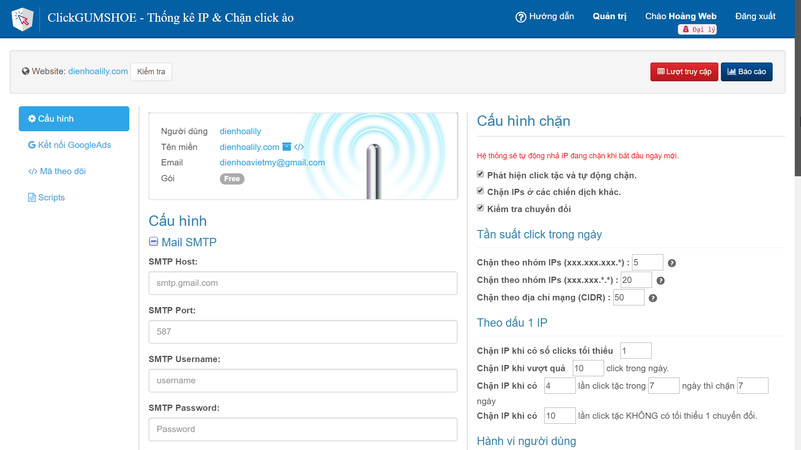
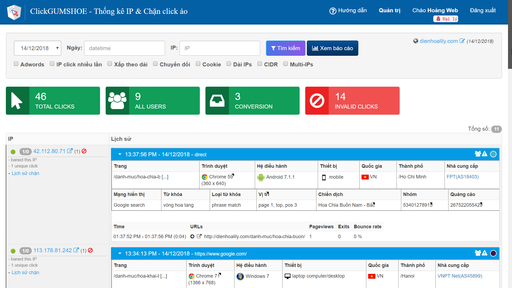
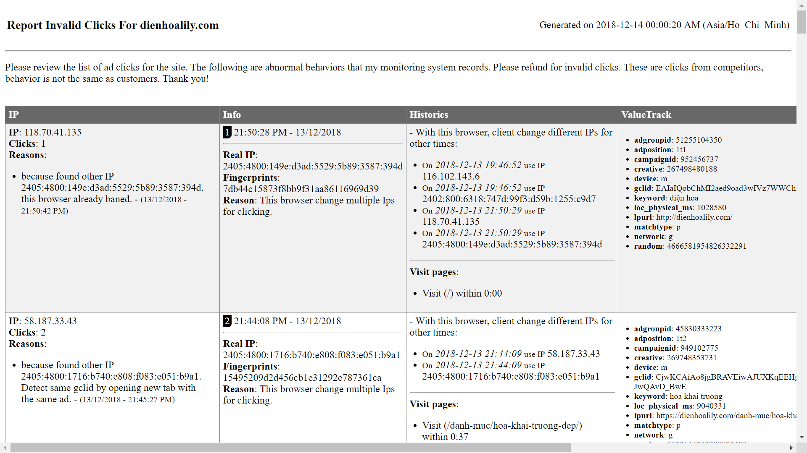
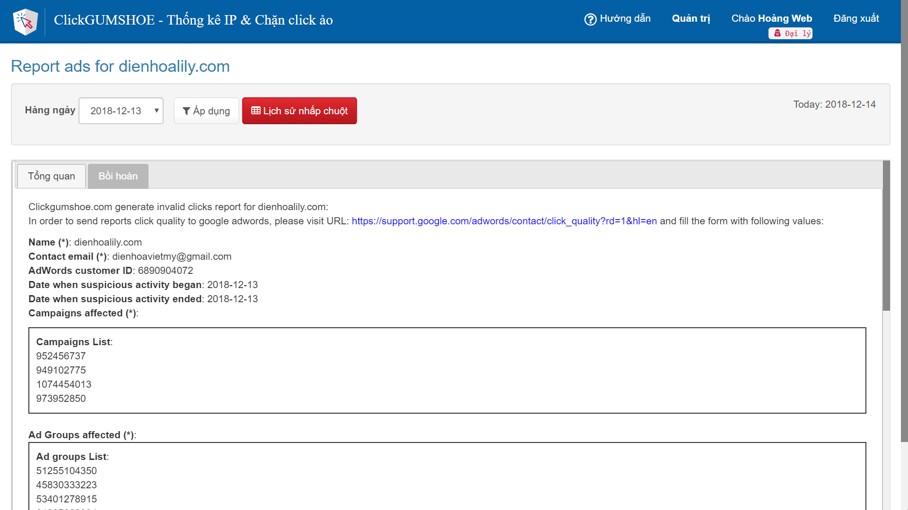

# Hướng dẫn chung

### Phần mềm miễn phí 100%

[Clickgumshoe.com](https://Clickgumshoe.com) là phần mềm theo dõi hành vi truy cập trang web và chặn IP click ảo tự động. Đây là giải pháp hạn chế click tặc quảng cáo Google.

> * Tính năng phần mềm [https://chongclicktac.com/phan-mem-chan-click-ao](https://chongclicktac.com/phan-mem-chan-click-ao) 
> * Cách chặn click ảo hiệu quả [https://www.hoangweb.com/cong-cu/5-cach-chan-click-ao-click-tac-khi-quang-cao-google](https://www.hoangweb.com/cong-cu/5-cach-chan-click-ao-click-tac-khi-quang-cao-google)

### Hình ảnh phần mềm



















### Các bước cài đặt

Cài đặt gồm 6 bước, bạn làm theo thứ tự các bước ở menu phía bên trái.

> 1. Tạo tài khoản & thêm website
> 2. Thêm Server & CSDL
> 3. Cấu hình
> 4. Kết nối Google Ads
> 5. Gắn mã theo dõi
> 6. Kiểm tra cài đặt

### Về tác giả

**Hoàng Huy**  
Email: hoangweb24@gmail.com  
Hotline/Zalo: 0987.342.124  
Website: [https://www.hoangweb.com](https://www.hoangweb.com)  
FB: [https://www.facebook.com/hoangweb24](https://www.facebook.com/hoangweb24)

| Ủng hộ tôi | Tài khoản ngân hàng |
| :--- | :--- |
|  | **QUÁCH QUANG HUY** Số tài khoản: 0021 000 236 449 Vietcombank – Chi nhánh Hoàn Kiếm, Hà Nội |

**Hãy bắt đầu để bảo vệ chiến dịch quảng cáo của bạn ngay hôm nay!**

