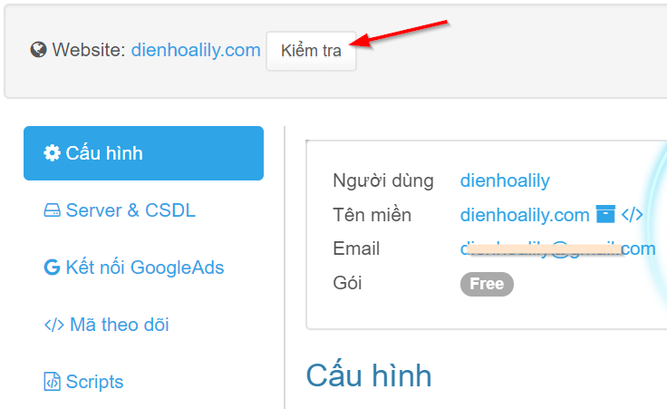
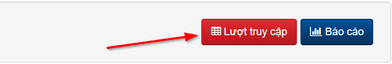
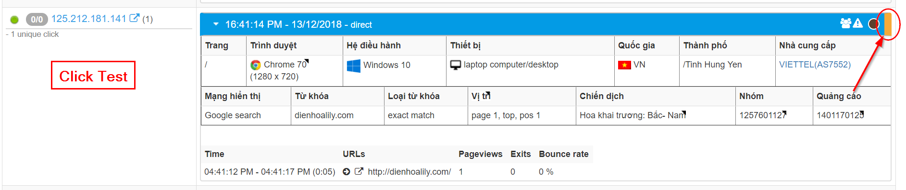

# 6. Kiểm tra cài đặt

Chúc mừng bạn!  
Đây là bước cuối cùng để kiểm tra các bước cài đặt của bạn đã hoạt động chưa. Trong phần cấu hình website, bạn nhấn nút "**Kiểm tra**" như hình dưới:

Sau khi nhấn "**Kiểm tra**", website của bạn được mở ở tab trình duyệt mới. Sau đó bạn di chuyển đến tính năng xem lượt truy cập để kiểm tra có ghi nhận click\_test không. Tại cấu hình website, bạn nhấn nút "**Lượt truy cập**" như hình dưới:

> * **Lượt truy cập**: giúp bạn xem lịch sử IP và hành vi click ảo.
> * **Báo cáo**: giúp bạn phân tích và gửi bồi hoàn.

Nếu cài đặt thành công, bạn sẽ thấy click\_test như hình dưới:

> Lưu ý:
>
> * Nếu chưa thấy click\_test thì bạn lấy mã javascript mới thay thế mã javascript cũ \(làm lại [bước 5](https://help.clickgumshoe.com/bat-dau-cai-dat/gan-ma-theo-doi-website/co-ban)\). Sau khi đổi mã mới, bạn nhấn lại "**Kiểm tra**" nếu thấy click\_test thì đã thành công!
> * Nếu vẫn chưa thấy click\_test thì bạn kiểm tra lại bước [kết nối Server & CSDL](https://help.clickgumshoe.com/bat-dau-cai-dat/cau-hinh-server-and-database/may-chu-server).

**Chúc bạn loại trừ được nhiều IP click tặc :\)**

