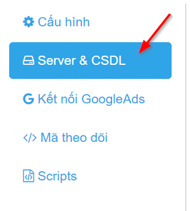

# 2. Thêm Server & CSDL

Sau khi thêm website thành công, bạn được chuyển đến trang cấu hình “Server & CSDL”.

Cấu hình Server & CSDL gồm có:

* Máy chủ \(Server\)
* Cơ sở dữ liệu \(CSDL\)
* Lưu cấu hình

