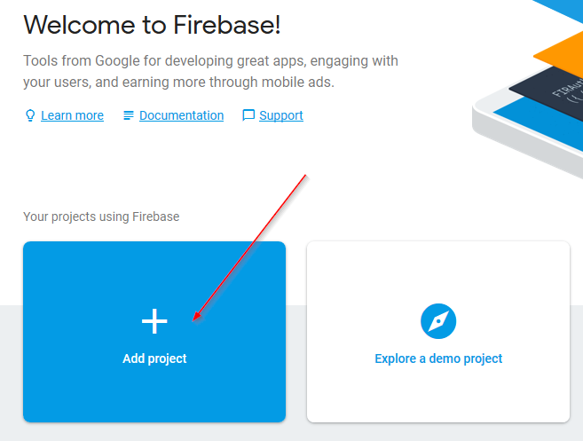
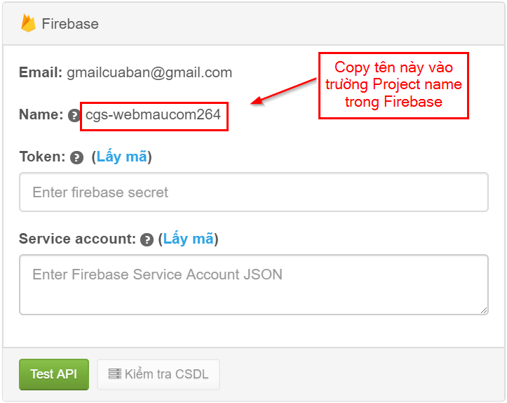
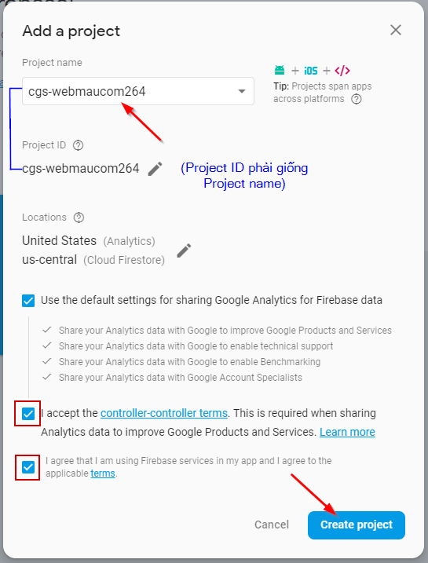
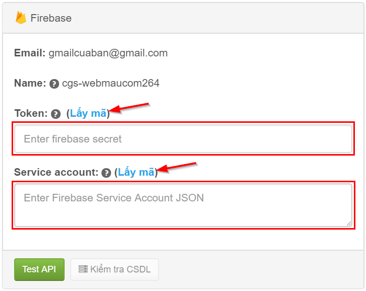
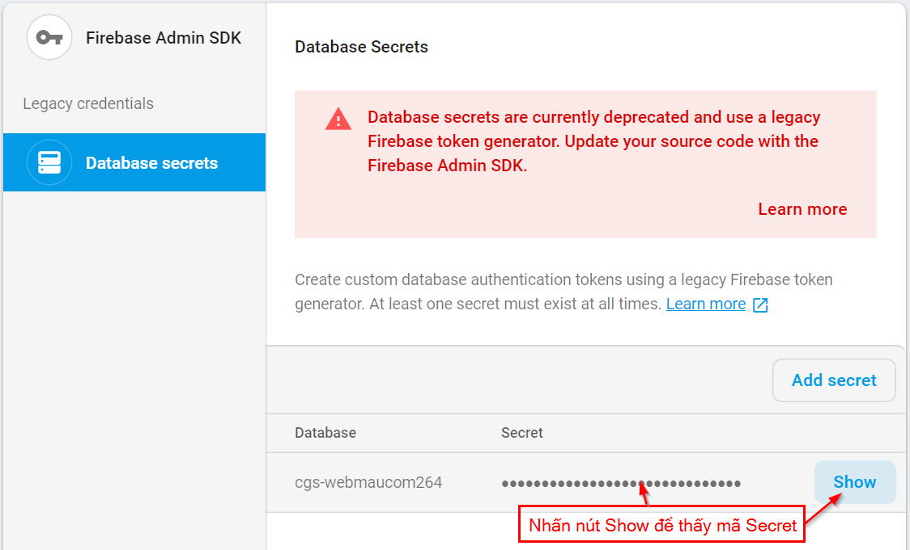
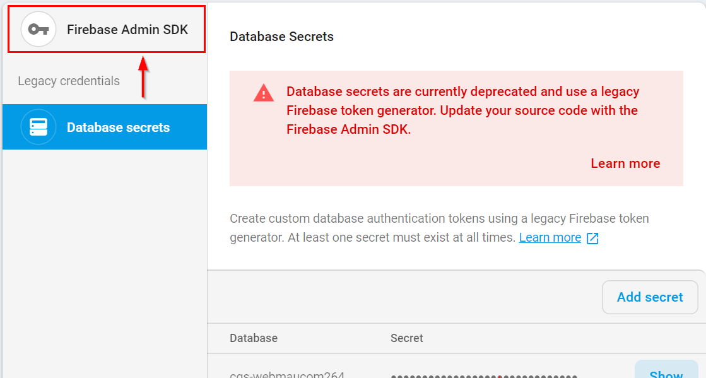
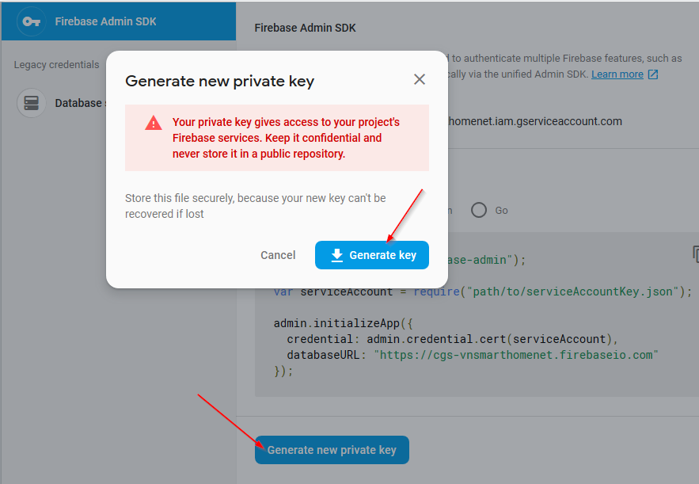
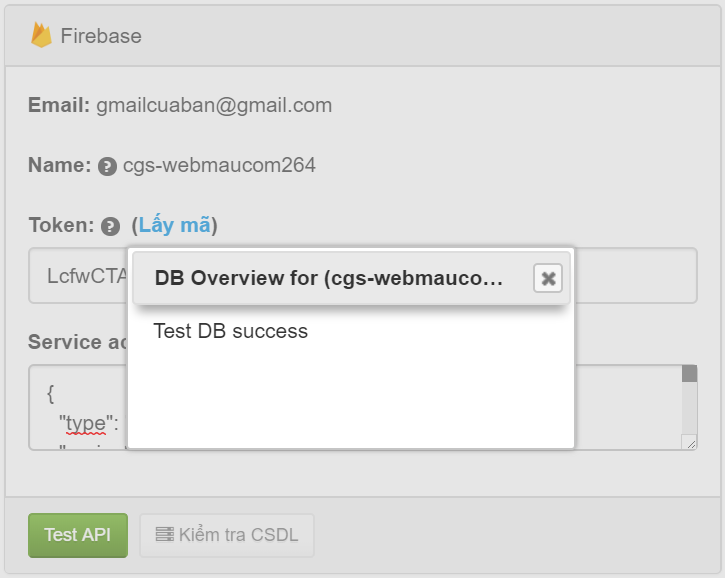

# Cơ sở dữ liệu \(CSDL\)

> Google Firebase là một dịch vụ cơ sở dữ liệu thời gian thực hoạt động trên nền tảng đám mây được cung cấp bởi Google. Phần mềm ClickGumshoe sử dụng Firebase để lưu trữ CSDL và hiển thị báo cáo cho bạn. \(xem thêm tại [wikipedia](https://en.wikipedia.org/wiki/Firebase)\)

### Tạo CSDL

Để tạo CSDL, bạn truy cập Firebase \(Google\) [https://firebase.google.com](https://firebase.google.com/) và đăng nhập với tài khoản gmail bạn thêm ở phần [thêm website](https://help.clickgumshoe.com/bat-dau-cai-dat/tao-tai-khoan#them-website). Sau đó bạn nhấn vào "**GO TO CONSOLE**" như hình dưới.

Tiếp đến, nhấn vào “**Add project**” để tạo CSDL.

Tiếp đến, bạn điền tên CSDL vào trường “Project name”. Lưu ý: tên này bạn copy ở mục Name. Ví dụ như hình dưới:

Giống như thế này:

Nhấn nút “**Create project**” để tạo CSDL. Lưu ý: Project ID phải cùng tên này.

### Kết nối CSDL \(Firebase\)

Tiếp theo, bạn lấy thông tin **Token** & **Service account** của CSDL vừa tạo ở trên.

Để lấy mã **Token**, bạn nhấn vào liên kết “**Lấy mã**” ở trường Token, liên kết này sẽ mở trang cấu hình CSDL của Firebase. Dê chuột vào vùng Secret và nhấn nút "Show" để thấy thông tin.

Copy chuỗi này và dán vào trường **Token**.

Tiếp đến, để lấy thông tin Service account, bạn làm tương tự. Nhấn vào liên kết “**Lấy mã**” ở trường Service account hoặc ở ngay hình trên nhấn vào tab “**Firebase Admin SDK**” như hình dưới:

Nhấn nút “**Generate new private key**” & nhấn tiếp “**Generate key**” để tải file .json về máy tính.

Mở file này với notepad hoặc notepad++, và copy nội dung trong file vào trường Service account.

Cuối cùng, bạn nhấn nút “**Test API**” để kiểm tra thông tin CSDL đã chính xác chưa. Nếu thành công sẽ báo như hình dưới.

