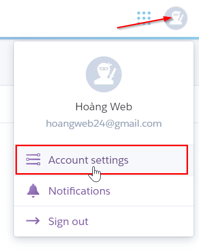

# Máy chủ \(Server\)

> Heroku là dịch vụ cung cấp máy chủ \(server\) miễn phí được cung cấp bởi Salesforce.com. Phần mềm ClickGumshoe sử dụng Heroku để phân tích & xử lý nhấp chuột từ chiến dịch quảng cáo Google của bạn. \(tìm hiểu thêm Heruku tại [wikipedia](https://en.wikipedia.org/wiki/Heroku)\)

### Tạo tài khoản Heroku

Để khởi tạo server, bạn cần có tài khoản **Heroku**. Truy cập trang [https://signup.heroku.com](https://signup.heroku.com/) và đăng ký tài khoản với gmail bạn điền ở bước [thêm website](https://help.clickgumshoe.com/bat-dau-cai-dat/tao-tai-khoan#them-website).

> Lưu ý: Sau khi đăng ký, bạn mở email để kích hoạt tài khoản và tạo mật khẩu \(nhớ đừng bỏ qua bước này\)

### Kết nối server \(Heroku\)

Sau khi có mật khẩu, bạn quay lại phần cấu hình “Server & CSDL”. Ở mục “Heroku” bạn điền mật khẩu tài khoản Heroku.

Sau đó bạn nhấn nút “**Test API**” để kiểm tra kết nối Server. Nếu thành công sẽ thấy thông báo như hình dưới.

### Xác minh tài khoản Heroku \(khuyến nghị\)

Bạn nên xác minh tài khoản Heroku nếu website của bạn nhận &gt;300 click/ngày. Để xác minh, bạn chỉ cần thêm thẻ Visa vào tài khoản.

Bạn làm theo các bước như hình dưới:

Sau khi điền đầy đủ thông tin và số thẻ Visa, bạn nhấn "**Save Details**". Nếu thêm thẻ Visa thành công thì tài khoản của bạn đã xác minh thành công.

> Lưu ý: Trong thẻ của bạn cần có $1 \(~23 nghìn đồng\) để Heroku lấy phí xác minh. Bạn chỉ cần xác minh một lần và được sử dụng vĩnh viễn.

