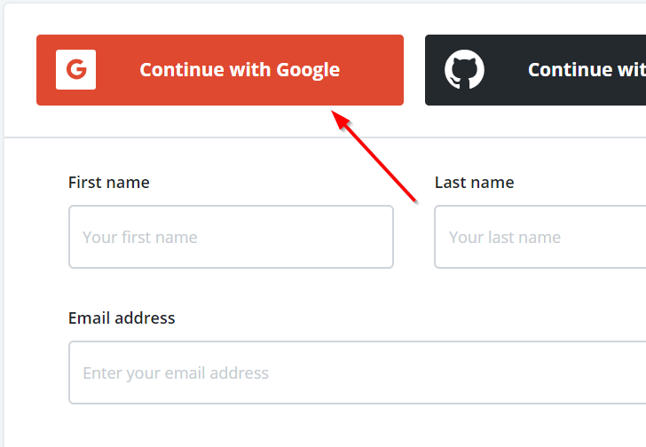
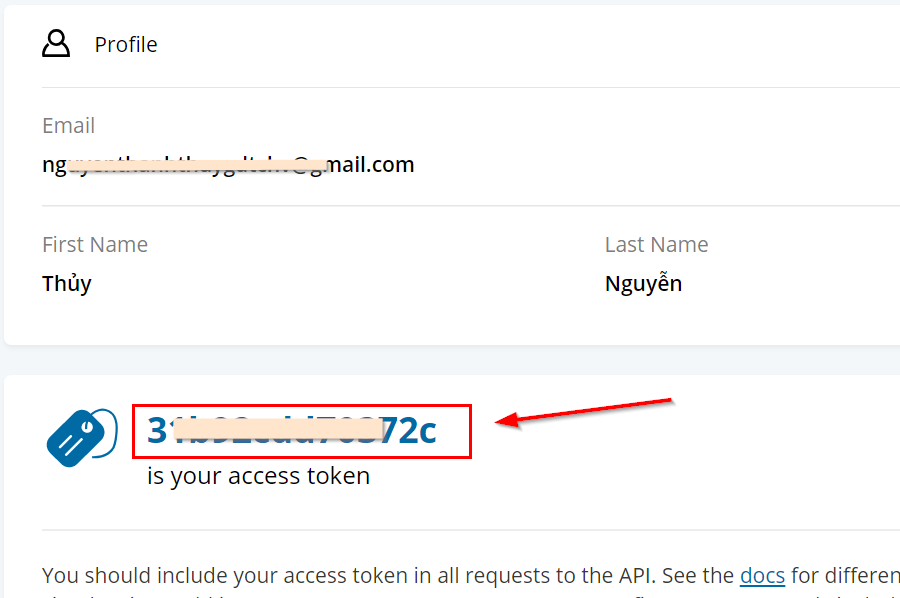
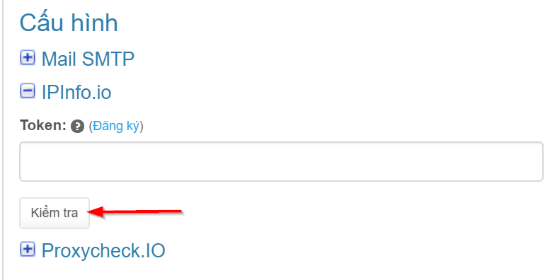
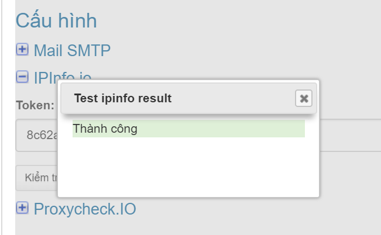

# IPInfo.io

### Lấy mã token

Truy cập vào địa chỉ [https://ipinfo.io/signup](https://ipinfo.io/signup), bạn đăng ký tài khoản với email bất kỳ hoặc chọn đang nhập với tài khoản gmail \(Google\) để đăng ký nhanh.

Chờ 5-10 giây trang web đăng nhập thành công, bạn sẽ thấy mã token như hình dưới:

### Kiểm tra

Copy mã token này vào trường "Token" và nhấn nút “**Kiểm tra**” để xác minh API.

Kết quả báo thành công như hình dưới.

