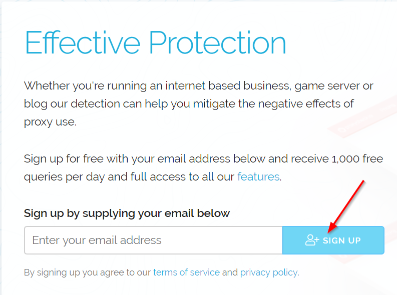
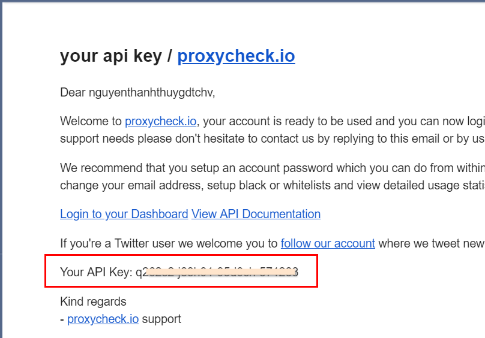
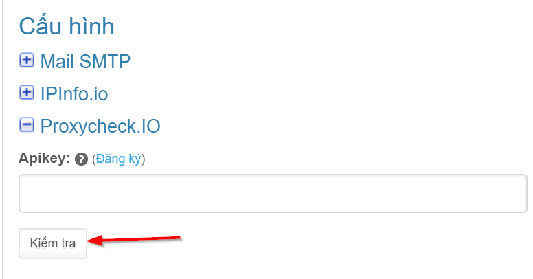
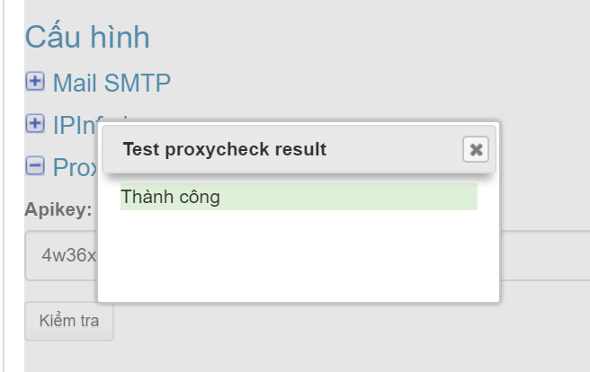

# Proxycheck.io

### Lấy mã API key

Truy cập vào địa chỉ [https://proxycheck.io](https://proxycheck.io), bạn đăng ký tài khoản bằng cách điền email bất kỳ của bạn và nhấn nút “SIGN UP”.

Sau đó mở email, bạn sẽ thấy API Key như hình dưới.

### Kiểm tra

Copy giá trị này vào trường "Apikey" và nhấn nút "**Kiểm tra**", nếu thành công bạn sẽ thấy thông báo như hình dưới.

