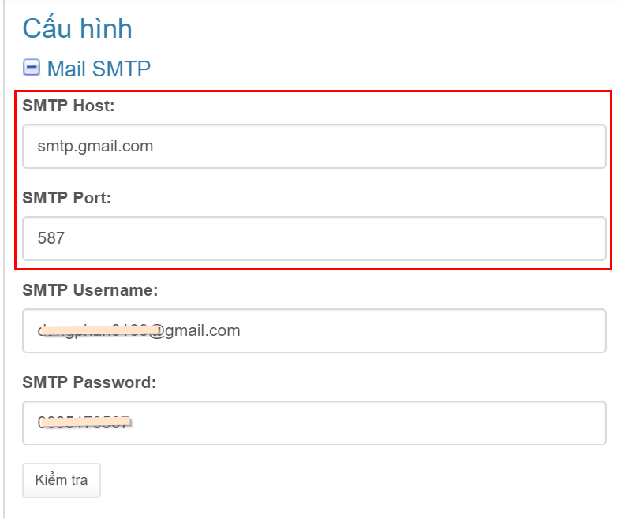
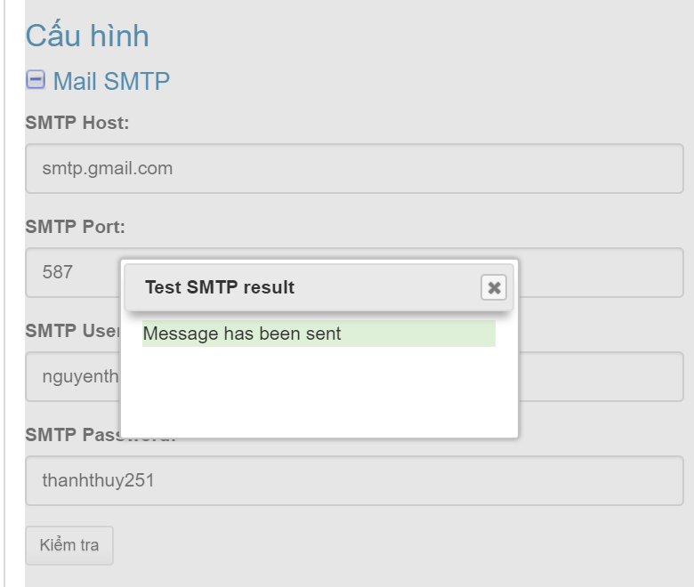

# Mail SMTP

### Cấu hình SMTP

Bạn copy 1 trong 3 cấu hình SMTP của 3 dịch vụ email phổ biến như gmail, yahoo mail hoặc hotmail dưới đây:

**Gmail SMTP**

* SMTP Host: smtp.gmail.com
* SMTP Port: 587

**Yahoo SMTP**

* SMTP Host: smtp.mail.yahoo.com
* SMTP Port: 465

**Live/Hotmail SMTP**

* SMTP Host: smtp.live.com
* SMTP Port: 587

Còn 2 trường **SMTP Username** và **SMTP Password** chính là tài khoản đăng nhập email của bạn.

> Lưu ý: Email này dùng làm hệ thống gửi báo cáo. Vì vậy không lấy email bạn điền ở bước [thêm website](https://help.clickgumshoe.com/bat-dau-cai-dat/tao-tai-khoan#them-website) \(vì email đó là email sẽ nhận báo cáo\). Bạn sẽ tạo một email khác \(nên dùng gmail\).

### Kiểm tra

Cuối cùng nhấn nút "**Kiểm tra**" để test SMTP, nếu thành công bạn nhận mail báo thành công và thông báo như hình dưới:

