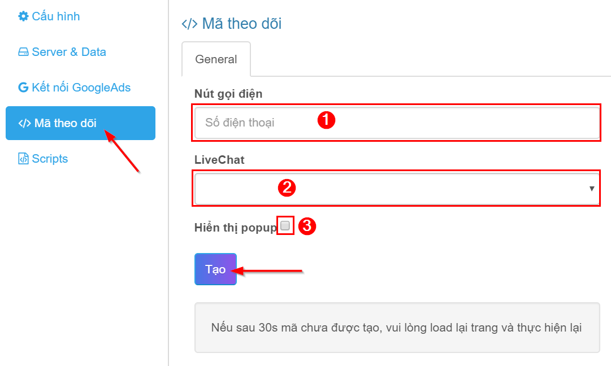
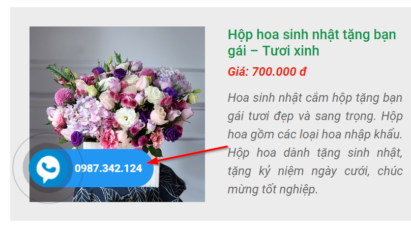
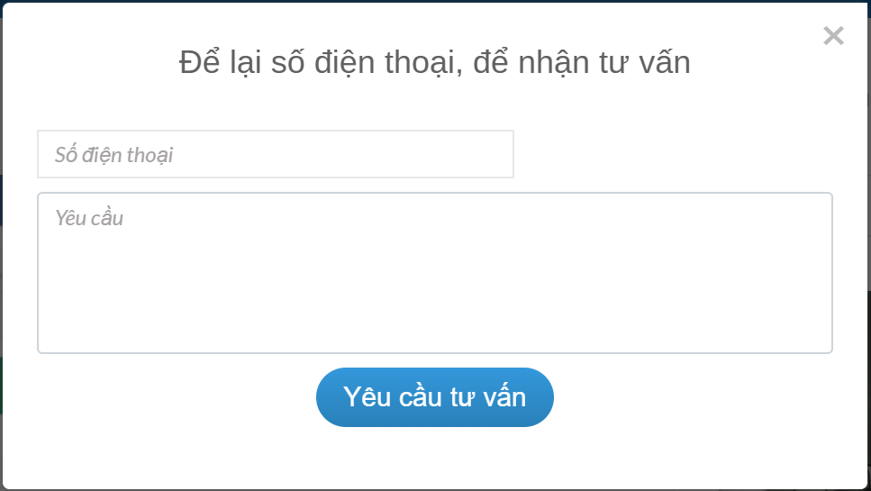
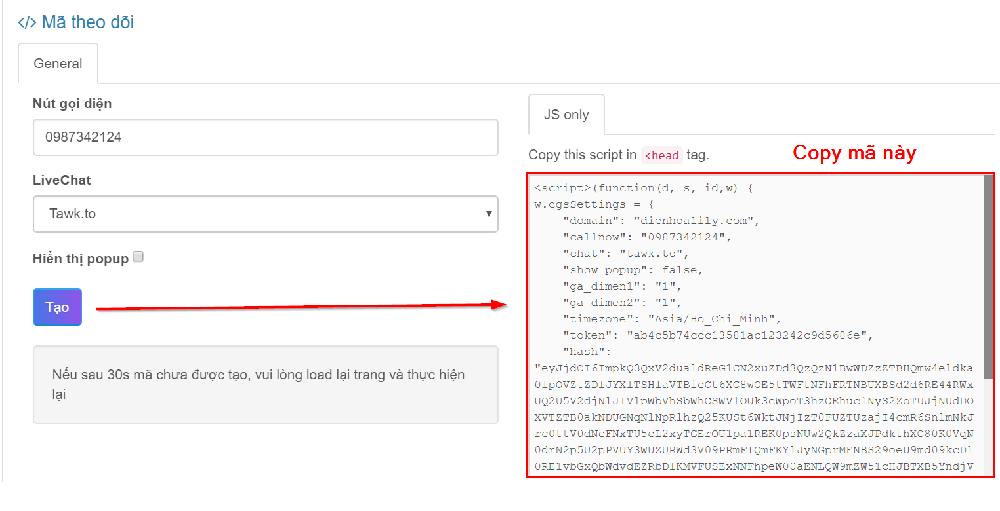

# Cách 1 \(Javascript\)

> * **Ưu điểm**: Đơn giản, dễ làm.
> * **Nhược điểm**: Không theo dõi được click chuột nếu javascript bị chặn trên trình duyệt.

Trên tab "Mã theo dõi" bạn sẽ cấu hình chuyển đổi, sau đó lấy mã javascript để chèn vào website.



### Cấu hình chuyển đổi

1. **Nút gọi điện**: nhập số điện thoại của bạn. Đây là tiện ích thêm nút gọi điện thoại trên website được tích hợp sẵn trong mã theo dõi. Nó hiển thị như hình dưới:



Nếu website của bạn đã có nút gọi điện rồi thì không cần nhập ô này, thay vào đó chỉ việc thêm thẻ class "cgs-phone-call" vào thẻ HTML của nút gọi đã có sẵn trên website của bạn, như thế này:

```text
<a href="tel:+84xxxxxxxxxxx" class="cgs-phone-call">Gọi cho tôi!</a>
```

2. **LiveChat**

Phần mềm hỗ trợ hầu hết các dịch vụ Chat phổ biến hiện nay \(Tawk.to, Bitrix, Zopim, Drift, Chatra\). Để kích hoạt theo dõi Chat, bạn chỉ chọn dịch vụ Chat bạn đang sử dụng.

> Lưu ý: Để chuyển đổi theo dõi chính xác, vui lòng không cấu hình tự động bật khung chat ở dịch vụ bạn đang sử dụng.

3. **Hiển thị popup**

Nếu tích vào ô Hiển thị popup thì khi click quảng cáo sẽ hiển thị popup trên website như hình dưới:



Nếu khách hàng điền form thì thông tin sẽ gửi về email khi bạn điền ở bước [thêm website](https://help.clickgumshoe.com/bat-dau-cai-dat/tao-tai-khoan#them-website).

> Lưu ý:
>
> * Tùy chọn "Hiển thị popup" không bắt buộc.
> * Đa số các phần mềm auto click hiện nay không có hành vi truy cập đa dạng trên website. Kích hoạt popup là ý tưởng để bạn biết được đối thủ click quảng cáo của bạn chủ yếu do người thật hay phần mềm.

### Tạo mã javascript

Cuối cùng, nhấn nút "Tạo" để lấy mã Javascript và gắn trong cặp thẻ_**&lt;head&gt;&lt;/head&gt;**_ trên website của bạn. _\(Nếu bạn không quen làm việc này thì hãy gửi đoạn code, nhờ kỹ thuật web hỗ trợ\)_





Ở trên chưa có cấu hình chuyển đổi cho Form, nếu bạn muốn theo dõi chuyển đổi form thì phải cấu hình thêm.  
Bạn chỉ cần gắn thẻ class "cgs-submit-form" vào nút submit form:

```text
<input type="submit" value="Submit" class="cgs-submit-form"/>
```



