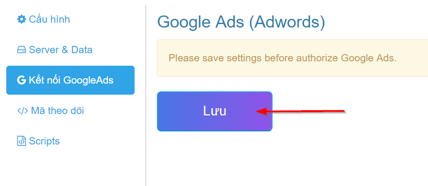
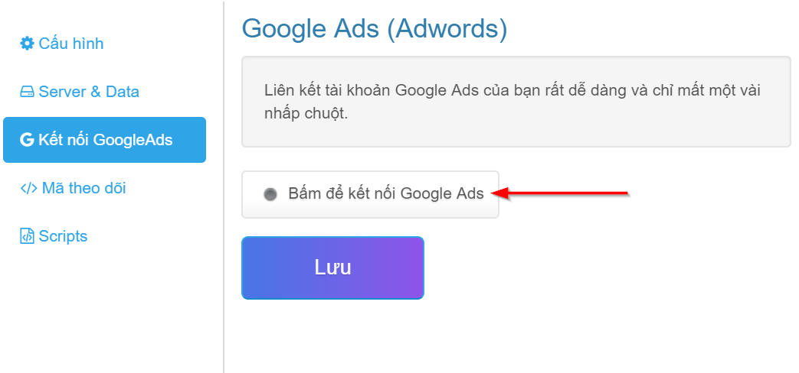
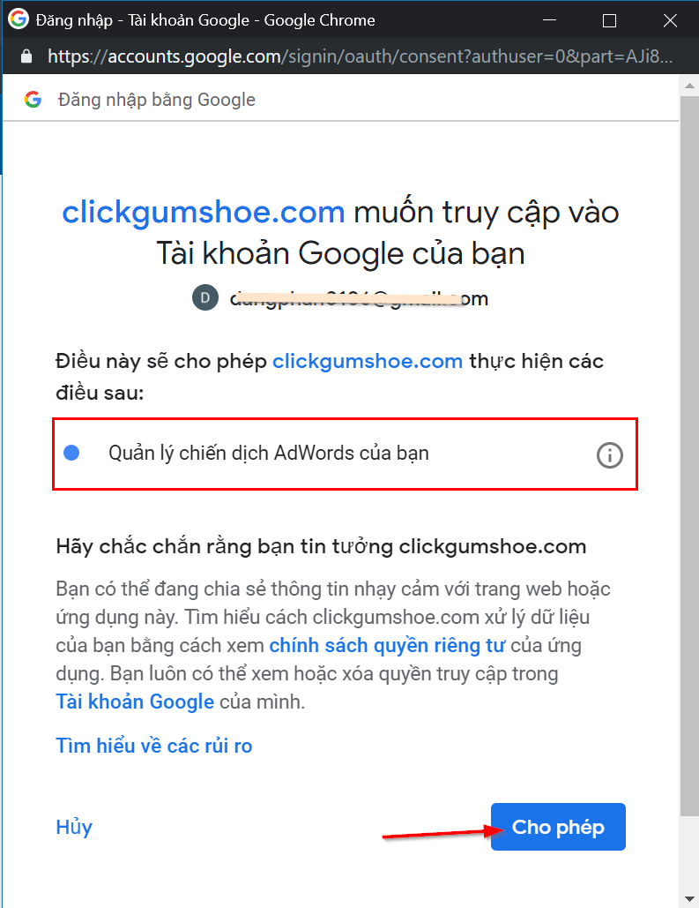
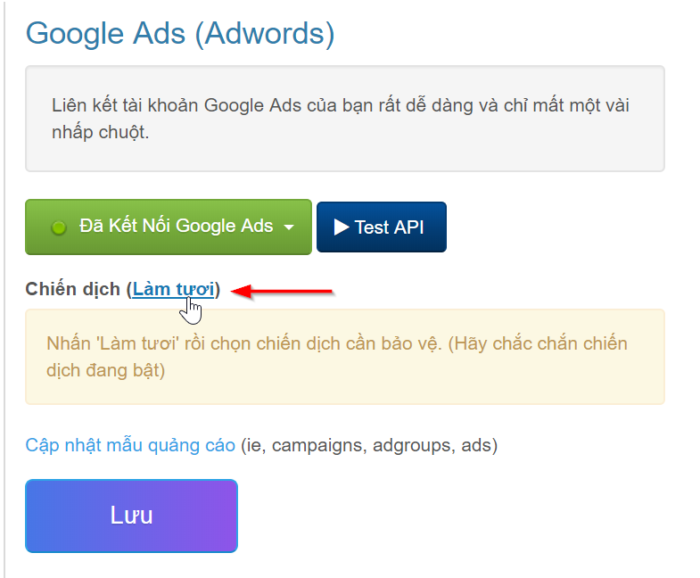
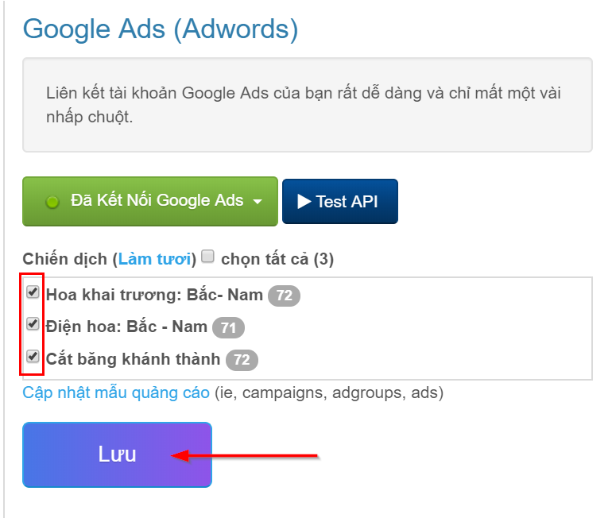
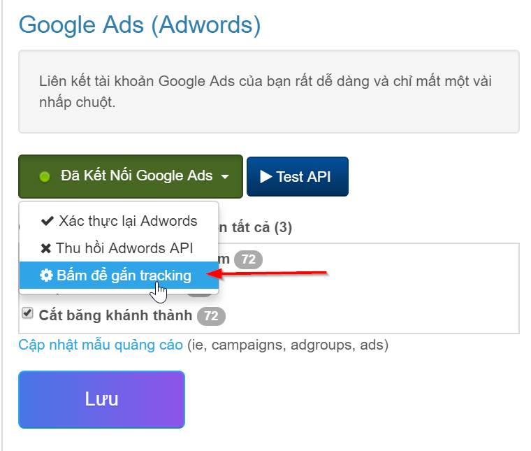
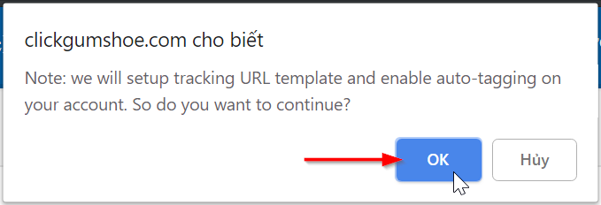
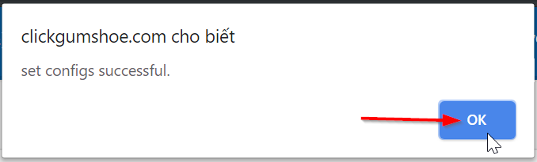
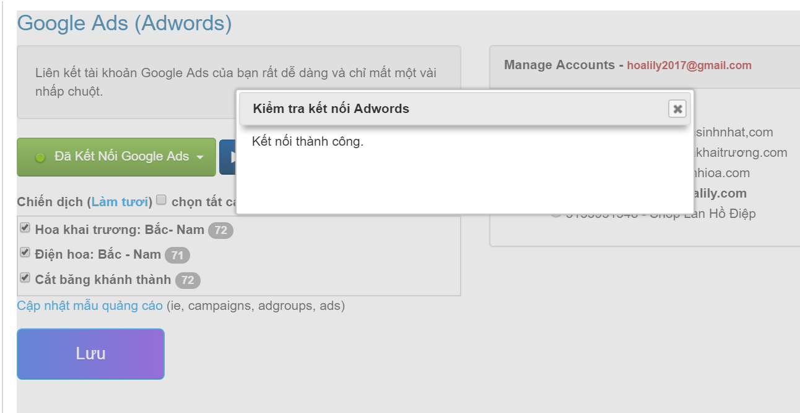

# Kết nối Google Ads

> **Đọc thêm:** [Tại sao cần kết nối tài khoản Google Ads?](https://help.clickgumshoe.com/huong-dan-su-dung-1/cau-hoi-thuong-gap-1)

### Kết nối tài khoản Google Ads

Để kết nối tài khoản quảng cáo Google, bạn nhấn vào tab "Kết nối GoogleAds", nhấn tiếp nút "**Lưu**".

Nhấn nút "**Bấm để kết nối Google Ads**"

Đăng nhập tài khoản quảng cáo Google của bạn và nhấn nút "**Cho phép**" như hình dưới:

Tiếp theo, nhấn nút "**Làm tươi**" để lấy thông tin chiến dịch.

Chọn các chiến dịch cần chặn IP click ảo và nhấn "**Lưu**".

> Lưu ý: Nếu sau này bạn có chiến dịch mới, bạn cần "Làm tươi" và chọn thêm chiến dịch đó, rồi nhân "Lưu" để cập nhật.

### Gắn mã Tracking Template

Tiếp theo, gắn mã Tracking Template giúp bạn theo dõi các lần nhấp chuột quảng cáo. Nhấn vào nút "**Đã Kết Nối Google Ads**" và chọn "Bấm để gắn tracking"

### Kiểm tra kết nối

Cuối cùng, bấm "**Test API**" để kiểm tra kết nối. Nếu kết nối thành công sẽ báo như hình dưới.

