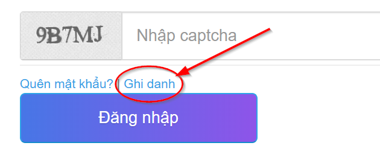
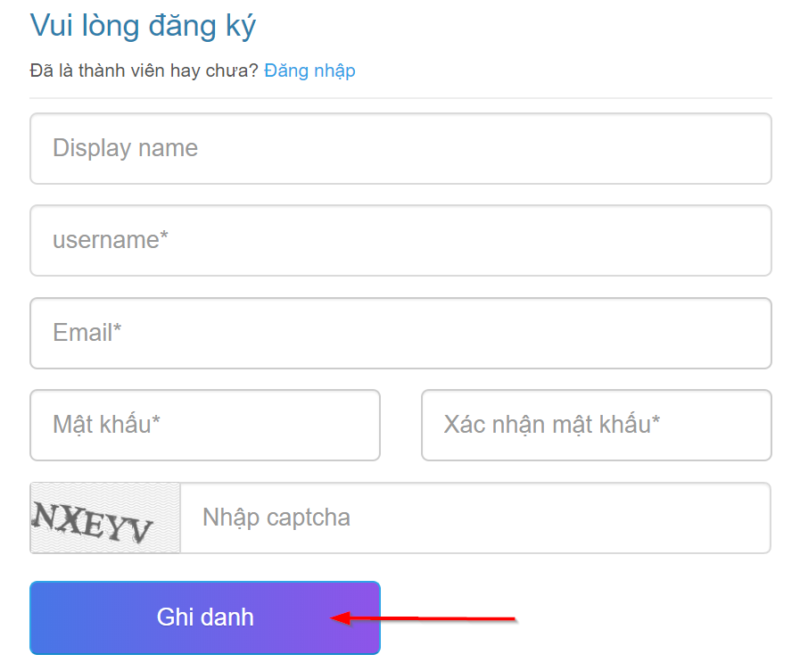
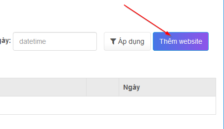

# 1. Tạo tài khoản & thêm website

### Tạo tài khoản

Đầu tiên bạn cần tạo một tài khoản người dùng, tại trang chủ [clickgumshoe.com](https://Clickgumshoe.com), bạn nhấn nút "**Ghi danh**" như hình dưới:

Điền đầy đủ thông tin: Tên hiển thị, username, email, mật khẩu, capcha và nhấn nút "Ghi danh" như hình dưới:

### Thêm website

Sau khi tạo tài khoản thành công, bạn được chuyển đến trang đăng nhập. Sau khi đăng nhập thành công, bạn nhấn vào nút “**Thêm website**” để thêm mới website.

Điền thông tin **tên miền** \(không gồm http:// hoặc https://\) và **email** sử dụng cho website \(Lưu ý: chỉ chấp nhận gmail\)

> Lưu ý: Nhập chính xác email vì bạn sẽ nhận báo cáo và thông tin khách hàng qua email đó.

Sau khi nhập đầy đủ thông tin bạn nhấn nút “**Thêm website**”. Nếu thành công bạn được chuyển đến trang cấu hình “Server & CSDL”.

