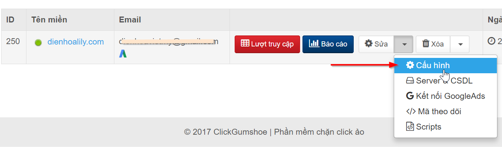

# Cấu hình chặn click ảo

Từ trang chủ, bạn nhấn nút "**Sửa**" hoặc nhấn mũi tên chọn "Cấu hình" như hình dưới:

Trong phần cấu hình, phía bên phải mục "Cấu hình chặn" là tùy chỉnh cấu hình chặn click ảo.

### Video hướng dẫn

Cấu hình chặn click ảo: [https://youtu.be/FqmClvZ\_cKs](https://youtu.be/FqmClvZ_cKs)

