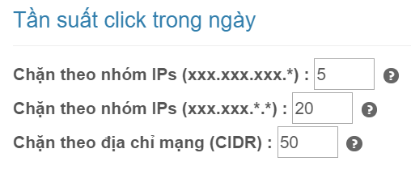
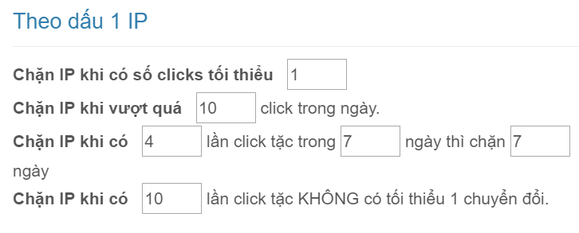

# Cấu hình chặn click ảo

Từ trang chủ, bạn nhấn nút "**Sửa**" hoặc nhấn mũi tên chọn "Cấu hình" như hình dưới:

Trong phần cấu hình, phía bên phải mục "Cấu hình chặn" là tùy chỉnh cấu hình chặn click ảo.

### Hướng dẫn cấu hình

Diễn giải chi tiết:

> * **Phát hiện click tặc và tự động chặn** : Nếu tích tùy chọn này, phần mềm sẽ tự động chặn IP click tặc.
> * **Chặn IPs ở các chiến dịch khác** : Nếu tích tùy chọn này, phần mềm tự động chặn IP ở tất cả các chiến dịch được chọn ở phần [kết nối GoogleAds](https://help.clickgumshoe.com/bat-dau-cai-dat/ket-noi-google-ads/ket-noi-api#ket-noi-tai-khoan-google-ads). Ngược lại nếu không chọn, phần mềm sẽ chỉ chặn IP ở chiến dịch có từ khóa bị click tặc.
> * **Kiểm tra chuyển đổi** : Nếu tích tùy chọn này, phần mềm sẽ kiểm tra người dùng có chuyển đổi không trước khi chặn.

> * **Chặn theo nhóm IPs \(xxx.xxx.xxx.\*\)** : Nghĩa là nếu có 5 IP cùng đầu xxx.xxx.xxx mà phần mềm phát hiện click tặc và bị chặn thì sẽ chặn cả nhóm xxx.xxx.xxx.\* .Mục đích là để không cho các IP nằm trong nhóm đó click nữa. Tùy chọn này có giá trị từ 3 đến 100, bạn có thể tự điều chỉnh cho phù hợp.
> * **Chặn theo nhóm IPs \(xxx.xxx.\*.\*\)** : tương tự như trên, khác ở chỗ là cùng đầu xxx.xxx .Tùy chọn này có giá trị từ 10 đến 100, bạn có thể tự điều chỉnh cho phù hợp.
> * **Chặn theo địa chỉ mạng \(CIDR\)** : CIDR là địa chỉ mạng lớn nhất của nhà mạng. Nghĩa là nếu 50 IP nằm trong địa chỉ CIDR mà bị chặn thì chặn cả địa chỉ CIDR đó. Để cấu hình này hoạt động, bạn hãy chọn phần nhà mạng ở phía dưới cùng. Tùy chọn này có giá trị từ 20 đến 10000, bạn có thể tự điều chỉnh cho phù hợp. _Lưu ý: CIDR có thể chứa hàng triệu IP, bạn nên để cấu hình này đủ lớn._

> * **Chặn IP khi có số clicks tối thiểu** : Tùy chọn này có giá trị 1 hoặc 2. Nếu chọn 1, nghĩa là người dùng click lần 1 vào website \(lần đầu tiên\) phần mềm sẽ kiểm tra ngay đó là click tặc hay không. Nếu chọn 2, thì click lần 2 mới kiểm tra \(thường những lĩnh vực KH cần tìm hiểu thông tin trên website nhiều lần mới mua hàng\)
> * **Chặn IP khi vượt quá xx click trong ngày** : Tùy chọn này có giá trị từ 5 đến 100.

