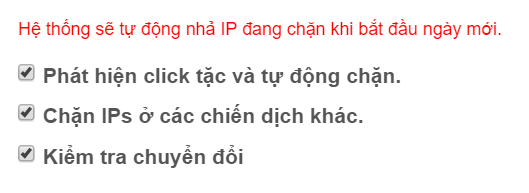
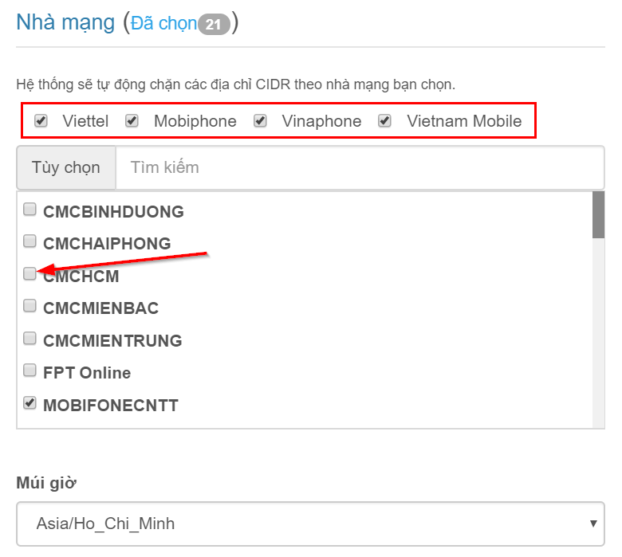

# Cấu hình chặn click ảo

Từ trang chủ, bạn nhấn nút "**Sửa**" hoặc nhấn mũi tên chọn "Cấu hình" như hình dưới:

Trong phần cấu hình, phía bên phải mục "Cấu hình chặn" là tùy chỉnh cấu hình chặn click ảo.

### Hướng dẫn cấu hình

Diễn giải chi tiết:

> * **Phát hiện click tặc và tự động chặn** : Nếu chọn, phần mềm sẽ tự động chặn IP click tặc.
> * **Chặn IPs ở các chiến dịch khác** : Nếu chọn, phần mềm tự động chặn IP ở tất cả các chiến dịch được chọn ở phần [kết nối GoogleAds](https://help.clickgumshoe.com/bat-dau-cai-dat/ket-noi-google-ads/ket-noi-api#ket-noi-tai-khoan-google-ads). Ngược lại nếu không chọn, phần mềm sẽ chỉ chặn IP ở chiến dịch có từ khóa bị click tặc.
> * **Kiểm tra chuyển đổi** : Nếu chọn, phần mềm sẽ kiểm tra người dùng có chuyển đổi không trước khi chặn.

> * **Chặn theo nhóm IPs \(xxx.xxx.xxx.\*\)** : Nghĩa là nếu có 5 IP cùng đầu xxx.xxx.xxx mà phần mềm phát hiện click tặc và bị chặn thì sẽ chặn cả nhóm xxx.xxx.xxx.\* .Mục đích là để không cho các IP nằm trong nhóm đó click nữa. Bạn điều chỉnh cho phù hợp.
> * **Chặn theo nhóm IPs \(xxx.xxx.\*.\*\)** : tương tự như trên, khác ở chỗ là cùng đầu xxx.xxx .Bạn điều chỉnh cho phù hợp.
> * **Chặn theo địa chỉ mạng \(CIDR\)** : CIDR là địa chỉ lớn nhất của nhà mạng. Nghĩa là nếu 50 IP nằm trong địa chỉ CIDR mà bị chặn thì chặn cả địa chỉ CIDR đó. Để cấu hình này hoạt động, bạn hãy chọn cấu hình Nhà mạng ở phía dưới. _Lưu ý: CIDR có thể chứa hàng triệu IP, bạn nên để cấu hình này đủ lớn._

> * **Chặn IP khi có số clicks tối thiểu** : Mặc định là giá trị 1, nghĩa là người dùng click lần 1 vào website \(lần đầu tiên\) phần mềm sẽ kiểm tra đó là click tặc hay không. Nếu chọn giá trị 2, thì click lần 2 mới kiểm tra. Bạn điều chỉnh cho phù hợp.
> * **Chặn IP khi vượt quá \(...\) click trong ngày** : Cấu hình này để hạn chế số lần click của 1 IP click trong ngày. Bạn điều chỉnh cho phù hợp.
> * **Chặn IP khi có \(...\) lần click tặc trong \(...\) ngày thì chặn \(...\) ngày** : Cấu hình này để chặn các IP click tặc nhiều lần liên tiếp nhiều ngày thì mình chặn các ngày tiếp theo. Bạn điều chỉnh cho phù hợp.
> * **Chặn IP khi có \(...\) lần click tặc KHÔNG có tối thiểu 1 chuyển đổi** : Cấu hình này để chặn các IP xấu \(IP xấu là click tặc nhiều lần nhưng không chuyển đổi\). Hệ thống sẽ theo dõi tỷ lệ chuyển đổi theo cấu hình của bạn. Bạn điều chỉnh cho phù hợp.

> * **Thời gian trên trang** : Cấu hình này được tính bằng giây, đo thời gian ở lại trang của người dùng. VD để mặc định 60 giây thì nếu người dùng sau khi click quảng cáo ở lại trang web &lt;60 giây và thoát trang thì phần mềm sẽ tự động chặn. Bạn điều chỉnh cho phù hợp.
> * **Thời gian chuyển đổi** : Cấu hình này được tính bằng giây, đo tổng thời gian người dùng ở lại trang trước khi chuyển đổi. Mục đích để xác định chuyển đổi là thật hay giả mạo, nếu &lt;120 giây là chuyển đổi giả và phần mềm sẽ tự động chặn. Bạn điều chỉnh cho phù hợp.

> Bạn hãy tích chọn các nhà mạng mà bạn muốn chặn địa chỉ CIDR \(ở cấu hình trên\). Ngoài các nhà mạng phổ biến như Viettel, Mobiphone, Vinaphone, Vietnam Mobile; bạn có thể chọn các nhà cung cấp khác ở khung chọn.

**Chúc các bạn thành công!**

